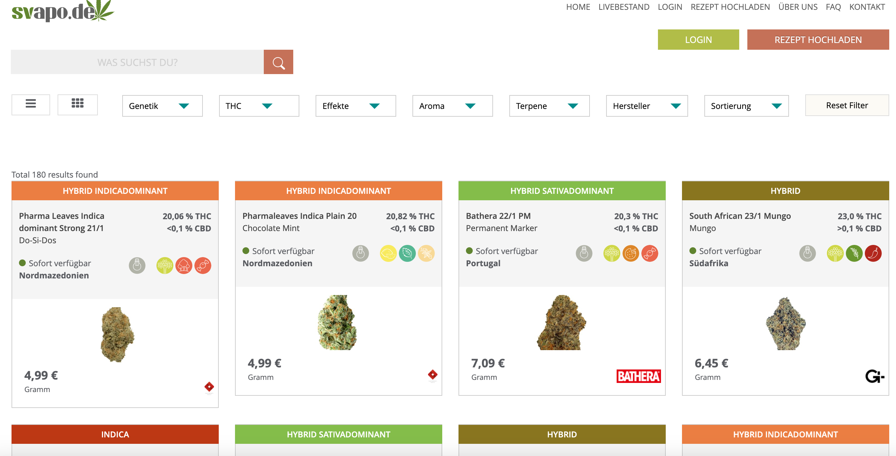
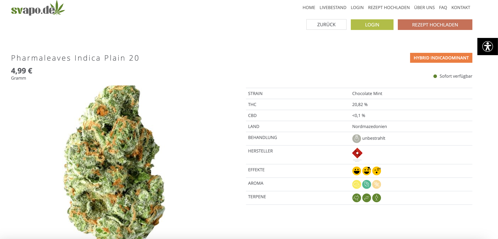
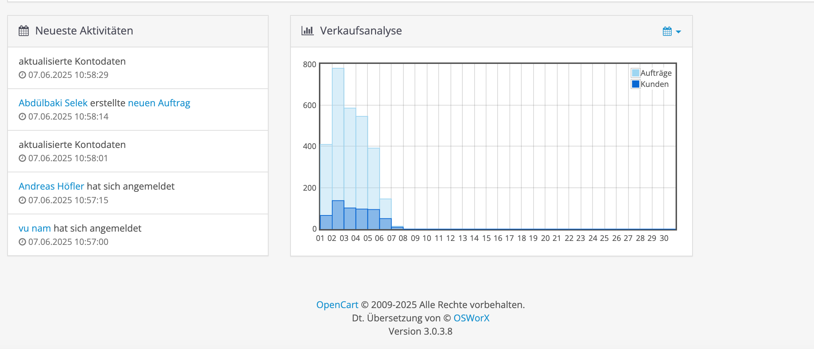

# Svapo.de - OpenCart E-commerce Platform

Welcome to the official repository for **Svapo.de**, an e-commerce platform built on **OpenCart**. This platform provides a full-featured, extensible, and secure online shopping experience, tailored to the vaping and e-liquid retail industry.

## 🌐 Live Website

👉 [Visit svapo.de](https://www.svapo.de/)

## 🛒 Project Overview

Svapo.de is powered by OpenCart and includes:

- Custom responsive theme optimized for performance and UX
- Product catalog with advanced filtering and search
- Multiple payment gateways (PayPal, credit card, etc.)
- Shipping options with dynamic rate calculation
- Multilingual and multicurrency support
- GDPR-compliant features
- SEO-friendly URLs and metadata

## 🧰 Tech Stack

- **OpenCart**: Core e-commerce functionality
- **PHP 7+**: Backend logic
- **MySQL**: Relational database
- **HTML5, CSS3, JavaScript (jQuery)**: Frontend technologies
- **Apache / Nginx**: Web server
- **VQMod / OCMOD**: Extension/mod override management

## 🚀 Getting Started

### Prerequisites

- Apache/Nginx web server
- PHP 7.3+ with extensions: `curl`, `mbstring`, `zip`, `gd`, `xml`
- MySQL or MariaDB
- Composer (if using custom PHP packages)

### Installation

1. Clone the repository:

   ```bash
   git clone https://github.com/vunamweb/svapo
   cd svapo-opencart

📸 Screenshots
| Page | Description |
|------|-------------|
|  | **Homepage**: Modern, responsive homepage showcasing featured categories, offers, and custom-designed wall decals. |
|  | **Category Page**: Clean grid layout with filters for size, color, theme, and more. Users can easily find the right product. |
|  | **Product Page**: Detailed view with high-resolution images, live color preview, size options, and related products. |
|  | **Shopping Cart**: Simple and intuitive cart system with editable quantities, shipping estimator, and coupon support. |
|  | **Admin Panel**: Clean and powerful admin interface to manage orders, products, customers, and SEO settings. |
